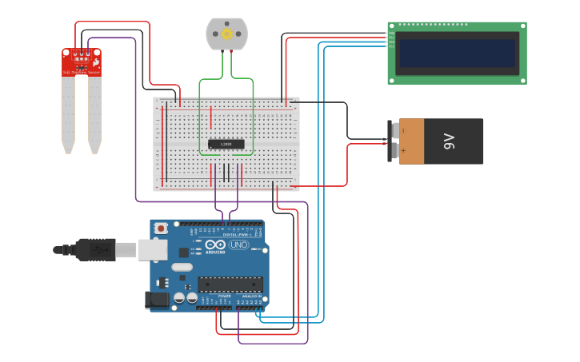

<div align='center'>

# 🌱 Automated Plant Watering System using Soil Moisture Sensor and Water Pump

</div>


## 📌 Overview

This experiment demonstrates an **automatic plant watering system** using an **Arduino, soil moisture sensor, L293D motor driver, water pump, and 16×2 I2C LCD**. The soil moisture sensor measures the moisture level of the soil and sends the reading to the Arduino. Based on the measured value, the Arduino automatically controls the water pump and displays the corresponding soil condition on the LCD.


## 🎯 Objective

- To design and implement an automatic plant watering system using Arduino.
- To detect soil moisture using a soil moisture sensor.
- To automatically control a water pump according to the soil condition.
- To display the moisture value and soil status on a 16×2 I2C LCD.
- To understand the practical application of sensor-based automation.


## 🧰 Apparatus

### 🛠️ Hardware Requirements

- Arduino Uno
- Soil Moisture Sensor
- L293D Motor Driver IC
- DC Water Pump / DC Motor
- 16×2 I2C LCD
- 9V Battery
- Breadboard
- Jumper Wires
- USB Cable
- Power Supply

### 💻 Software Requirements

- Arduino IDE
- Simulation Tool (Tinkercad / Wokwi)


## 🔌 Pin Configuration

| Component | Connection |
|-----------|------------|
| 🌱 Soil Moisture Sensor | Signal → A0, VCC → 5V, GND → GND |
| ⚙️ L293D Motor Driver | Input 1 → D8, Input 2 → D7 |
| 💧 Water Pump / DC Motor | Connected to L293D Motor Output |
| 🖥️ 16×2 I2C LCD | SDA → A4, SCL → A5, VCC → 5V, GND → GND |
| 🔋 Motor Power Supply | 9V Battery → Motor Driver |


## 📷 Circuit Diagram



🔗 **[View Live Simulation on Tinkercad](https://www.tinkercad.com/things/6XOmehuZJFM-plant-watering-system-using-soil-moisture-sensor-and-water-pump)**


## </> Source Code

The Arduino source code for this experiment is available in the [`Plant_Watering_System.ino`](Plant_Watering_System.ino) file included in this folder.


## ⚙️ Working Principle

The soil moisture sensor continuously measures the moisture level of the soil and sends an analog value to the Arduino through **A0**. The Arduino compares the measured value with predefined moisture limits and controls the water pump accordingly.

- When the moisture value is **800 or higher**, the soil is considered **dry**. The pump turns **ON**, and the LCD displays **"Dry Soil"**.
- When the moisture value is between **501 and 799**, the soil is considered **almost dry**. The pump remains **OFF**, and the LCD displays **"Almost Dry Soil"**.
- When the moisture value is **500 or lower**, the soil is considered **wet**. The pump remains **OFF**, and the LCD displays **"Wet Soil"**.
- The LCD continuously displays the measured moisture value and the corresponding soil condition.


## 📁 Project Files

```text
Plant Watering System/
│
├── Plant_Watering_System.ino
├── Circuit_Diagram.png
└── README.md
