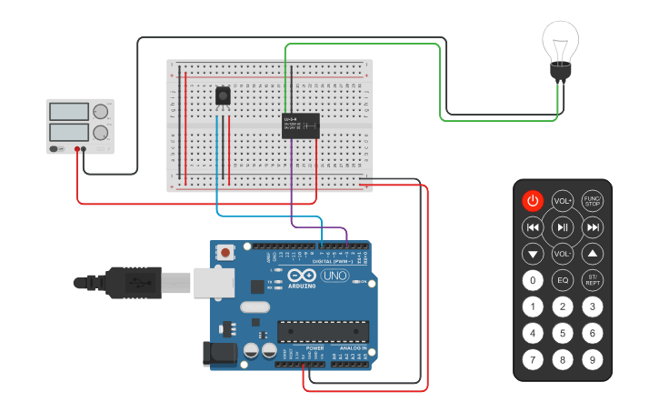

<div align='center'>

# 💡 Remote Control of AC Bulb

</div>


## 📌 Overview

This experiment demonstrates a **remote-controlled AC bulb system** using an **Arduino, IR receiver, IR remote, and relay module**. The IR receiver receives commands from the remote, and the Arduino processes the received signal to control the relay. The relay switches the AC bulb **ON or OFF** according to the remote command.


## 🎯 Objective

- To design and implement a remote-controlled AC bulb system using Arduino.
- To receive wireless commands using an IR receiver and remote.
- To control an AC bulb through a relay module.
- To understand the practical interfacing of IR communication and relay-based switching.
- To control electrical loads remotely using a microcontroller.


## 🧰 Apparatus

### 🛠️ Hardware Requirements

- Arduino Uno
- IR Remote
- IR Receiver
- Relay Module
- AC Bulb
- Breadboard
- Jumper Wires
- USB Cable
- Power Supply

### 💻 Software Requirements

- Arduino IDE
- Simulation Tool (Tinkercad / Wokwi)


## 🔌 Pin Configuration

| Component | Connection |
|-----------|------------|
| 📡 IR Receiver | Signal → D7, VCC → 5V, GND → GND |
| 🔌 Relay Module | Signal → D3, VCC → 5V, GND → GND |
| 💡 AC Bulb | Connected through Relay Module |


## 📷 Circuit Diagram



🔗 **[View Live Simulation on Tinkercad](YOUR_TINKERCAD_LINK)**


## </> Source Code

The Arduino source code for this experiment is available in the [`Remote_AC_Bulb_Control.ino`](Remote_AC_Bulb_Control.ino) file included in this folder.


## ⚙️ Working Principle

The IR receiver continuously waits for a signal from the IR remote. When a button is pressed, the receiver sends the corresponding IR command to the Arduino. The Arduino reads the received command and compares it with the predefined remote codes.

- When the **ON command** is received, the relay is activated and the AC bulb turns **ON**.
- When the **OFF command** is received, the relay is deactivated and the AC bulb turns **OFF**.
- The system continuously waits for new commands from the IR remote and changes the bulb state accordingly.


## 📁 Project Files

```text
Remote Control of AC Bulb/
│
├── Remote_AC_Bulb_Control.ino
├── Circuit_Diagram.png
└── README.md
