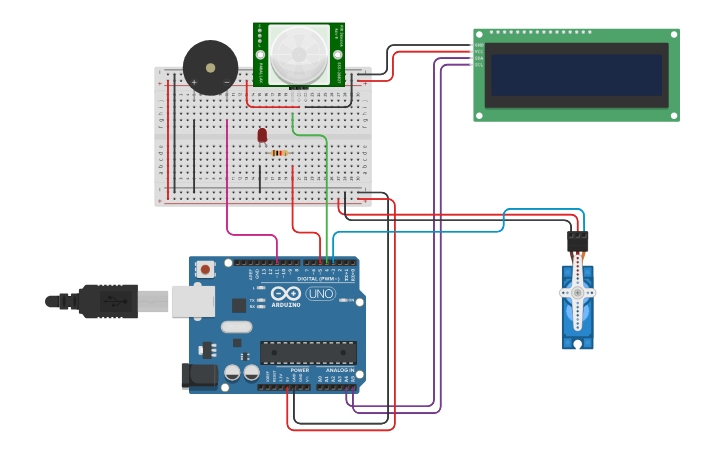

<div align='center'>

# 🚨 Theft Detection Using Door Sensor and Buzzer

</div>


## 📌 Overview

This experiment demonstrates a simple **wireless theft detection system** using an **Arduino, door sensor, and buzzer**. The door sensor is used to detect whether a door is opened or closed. When an unauthorized door opening is detected, the system activates the buzzer to provide an audible warning, helping to indicate a possible theft or intrusion attempt.


## 🎯 Objective

- To design and implement a simple theft detection system using Arduino.
- To detect door opening using a door sensor.
- To activate a buzzer when an unauthorized door opening is detected.
- To understand the basic concept of intrusion detection and alarm systems.


## 🧰 Apparatus

### 🛠️ Hardware Requirements

- Arduino
- PIR Sensor
- Buzzer
- Breadboard
- Jumper Wires
- USB Cable
- Power Supply

### 💻 Software Requirements

- Arduino IDE
- Simulation Tool (Tinkercad / Wokwi)


## 🔌 Pin Configuration

| Component | Connection |
|-----------|------------|
| 🚪 Door Sensor | Signal → D__ |
| 🔊 Buzzer | Positive → D__, Negative → GND |
| 🔋 Arduino Power | 5V → Positive Rail, GND → Ground Rail |


## 📷 Circuit Diagram



🔗 **[View Live Simulation on Tinkercad](https://www.tinkercad.com/things/cgmLMOmq4hP-theft-detection-using-door-sensor-and-buzzer)**


## </> Source Code

The Arduino source code for this experiment is available in the [`Wireless-Theft-Detection.ino`](Wireless-Theft-Detection.ino) file included in this folder.


## ⚙️ Working Principle

The door sensor continuously monitors the state of the door. The Arduino reads the sensor signal and determines whether the door is open or closed.

- When the door remains **closed**, the system stays in the normal monitoring state and the buzzer remains **OFF**.
- When the door is **opened**, the Arduino detects the change in the sensor state and activates the buzzer.
- The buzzer provides an audible warning to indicate a possible unauthorized entry.
- The system continuously monitors the door and responds automatically to any change in its state.


## 📁 Project Files

```text
Theft Detection/
│
├── Theft_Detection.ino
├── Circuit_Diagram.png
└── README.md
