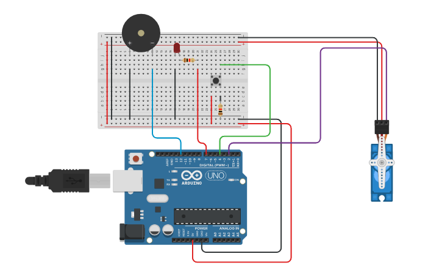

<div align='center'>

# 🔐 Touch Sensor Based Door Lock with LED, Buzzer and Servo Motor

</div>


## 📌 Overview

This experiment demonstrates a simple touch-based door lock system using an **Arduino, touch input, LED, buzzer, and servo motor**. A pushbutton is used to simulate the touch input. When the input is activated, the system provides visual and audible indications while the servo motor changes its position to simulate unlocking the door.


## 🎯 Objective

- To design and implement a simple touch-based door lock system using Arduino.
- To detect input using a pushbutton as a touch sensor.
- To control a servo motor for simulating the locking and unlocking of a door.
- To use an LED and buzzer as visual and audible indicators.
- To understand the practical interfacing of input and output devices with Arduino.


## 🧰 Apparatus

### 🛠️ Hardware Requirements

- Arduino Uno
- Piezo Buzzer
- Pushbutton 
- Servo Motor
- LED
- Resistor (220Ω–330Ω)
- Breadboard
- Jumper Wires
- USB Cable
- Power Supply

### 💻 Software Requirements

- Arduino IDE
- Simulation Tool (Tinkercad / Wokwi)


## 🔌 Pin Configuration

| Component | Connection |
|-----------|------------|
| 🔘 Pushbutton | One side → D4, Other side → 5V |
| 💡 LED | Anode → D7 through 220Ω–330Ω resistor, Cathode → GND |
| 🔊 Piezo Buzzer | Positive → D12, Negative → GND |
| ⚙️ Servo Motor | Signal → D2, VCC → 5V, GND → GND |
| 🔋 Arduino Power | 5V → Positive Rail, GND → Ground Rail |


## 📷 Circuit Diagram




## </> Source Code

The Arduino source code for this experiment is available in the [`Touch Sensor Based Door Lock.ino`](Touch-Sensor-Based-Door-Lock.ino) file included in this folder.


## ⚙️ Working Principle

The pushbutton is used to simulate the touch input of the door lock system. The Arduino reads the button state and controls the LED, buzzer, and servo motor according to the detected input.

- When the pushbutton is **pressed**, the LED turns ON, the buzzer produces a tone, and the servo motor rotates to **90°**, simulating an unlocked state.
- When the pushbutton is **released**, the LED turns OFF, the buzzer stops, and the servo motor returns to **0°**, simulating a locked state.
- The system continuously monitors the input and updates the output accordingly.


## 📁 Project Files

```text
Touch-Door-Lock/
│
├── Touch-Door-Lock.ino
├── Circuit Diagram.png
└── README.md
