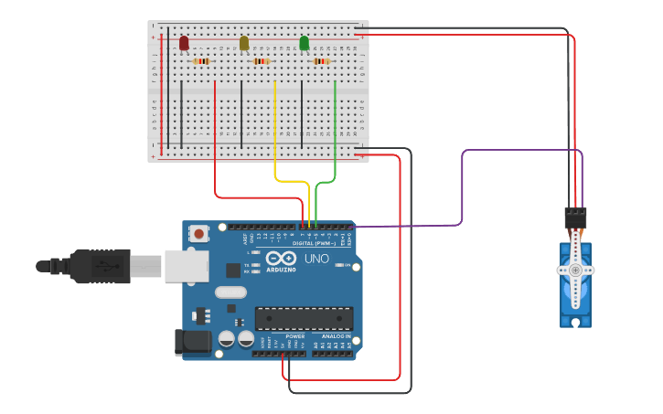

<div align ='center'>

# 🚦 Traffic Light Control Using Servo Motor and LEDs

</div>


## 📌 Overview

This experiment demonstrates a simple traffic light control system using an **Arduino, 3 LEDs, and a Servo Motor**. The Red, Yellow, and Green LEDs operate sequentially, while the servo motor moves to different positions according to the active traffic signal.


## 🎯 Objective

- To implement a basic traffic light control system using Arduino.
- To control Red, Yellow, and Green LEDs in a sequential manner.
- To control the position of a servo motor according to different traffic light conditions.
- To understand the practical interfacing of LEDs and a servo motor with Arduino.


## 🧰 Apparatus

### 🛠️ Hardware Requirements

- Arduino Uno
- Servo Motor
- Breadboard
- LEDs (Red, Yellow, Green)
- Resistors (220Ω–330Ω)
- Jumper Wires
- USB Cable
- Power Supply

### 💻 Software Requirements

- Arduino IDE
- Simulation Tool (Tinkercad / Wokwi)
- Arduino Programming Language (C/C++)


## 🔌 Pin Configuration

| Component | Connection |
|-----------|------------|
| 🔴 Red LED | Anode → D7 through 220Ω–330Ω resistor, Cathode → GND |
| 🟡 Yellow LED | Anode → D6 through 220Ω–330Ω resistor, Cathode → GND |
| 🟢 Green LED | Anode → D5 through 220Ω–330Ω resistor, Cathode → GND |
| ⚙️ Servo Motor | Signal → D0, VCC → 5V, GND → GND |
| 🔋 Arduino Power | 5V → VCC/Power rail, GND → Ground rail |

> **Note:** The servo signal pin is connected to **D0** according to the practical circuit setup.


## 📷 Circuit Diagram




## </> Code

The Arduino source code for this experiment is available in the [`Traffic_Light_Control.ino`](Traffic_Light_Control.ino) file included in this folder.


## ⚙️ Working Principle

The system operates through a continuous traffic light sequence:

1. **Red Light**
   - Red LED turns ON.
   - Servo motor moves to **90°**.
   - Duration: **2 seconds**

2. **Yellow Light**
   - Yellow LED turns ON.
   - Servo motor moves to **45°**.
   - Duration: **1 second**

3. **Green Light**
   - Green LED turns ON.
   - Servo motor moves to **0°**.
   - Duration: **2 seconds**

After completing the sequence, the system repeats the cycle continuously. 


## 📁 Project Files

```text
Traffic Light Control/
│
├── Traffic_Light_Control.ino
├── Circuit Diagram.png
└── README.md 
