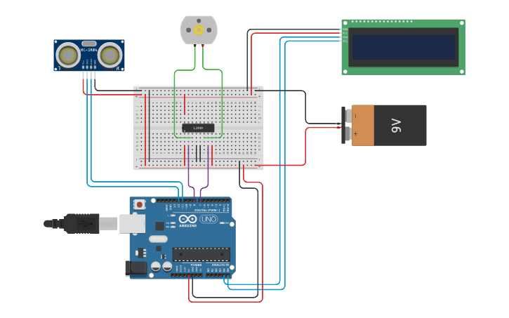

<div align='center'>

# 💧 Water Level Based Automatic Pump Control

</div>


## 📌 Overview

This experiment demonstrates an **Arduino-based automatic water level monitoring and pump control system** using an **HC-SR04 ultrasonic sensor, 16×2 I2C LCD, and motor driver**. The ultrasonic sensor measures the distance between the sensor and the water surface, while the Arduino controls the water pump according to the detected water level. The current tank status is also displayed on the LCD.


## 🎯 Objective

- To design and implement an automatic water level monitoring system using Arduino.
- To measure the distance between the ultrasonic sensor and the water surface.
- To control a water pump automatically based on predefined water level conditions.
- To understand the practical interfacing of sensors, displays, and motor drivers with Arduino.


## 🧰 Apparatus

### 🛠️ Hardware Requirements

- Arduino Uno
- HC-SR04 Ultrasonic Sensor
- 16×2 I2C LCD
- Motor Driver
- DC Water Pump / DC Motor
- 9V Battery
- Breadboard
- Jumper Wires
- USB Cable
- Power Supply

### 💻 Software Requirements

- Arduino IDE
- Simulation Tool (Tinkercad / Wokwi)


## 🔌 Pin Configuration

| Component | Connection |
|-----------|------------|
| 📡 HC-SR04 Ultrasonic Sensor | TRIG → D12, ECHO → D11 |
| ⚙️ Motor Driver | IN1 → D8, IN2 → D7 |
| 🖥️ 16×2 I2C LCD | SDA → A4, SCL → A5, VCC → 5V, GND → GND |
| 🔋 Arduino Power | 5V → Positive Rail, GND → Ground Rail |
| 🔋 9V Battery | Positive → Motor Driver Power Input, Negative → GND |


## 📷 Circuit Diagram



🔗 **[View Live Simulation on Tinkercad](https://www.tinkercad.com/things/fllLhmeG2yM-water-level-based-automatic-pump-control)**


## </> Source Code

The Arduino source code for this experiment is available in the [`Water_Level_Based_Automatic_Pump_Control.ino`](Water-Level-Based-Automatic-Pump-Control.ino) file included in this folder.


## ⚙️ Working Principle

The HC-SR04 ultrasonic sensor is used to measure the distance between the sensor and the water surface. The Arduino sends an ultrasonic pulse through the **TRIG** pin and receives the reflected signal through the **ECHO** pin. The measured time is then converted into distance in centimeters.

- When the measured distance is **50 cm or less**, the system considers the tank **full**, turns the water pump **OFF**, and displays **"TANK FULL"** on the LCD.
- When the measured distance is **greater than 150 cm**, the system considers the water level **low**, activates the water pump, and displays **"NOT FULL"** on the LCD.
- The system continuously monitors the water level and controls the pump according to the programmed conditions.


## 📁 Project Files

```text
Water Level & Pump Control/
│
├── Water_Level_Based_Automatic_Pump_Control.ino
├── Circuit_Diagram.png
└── README.md
